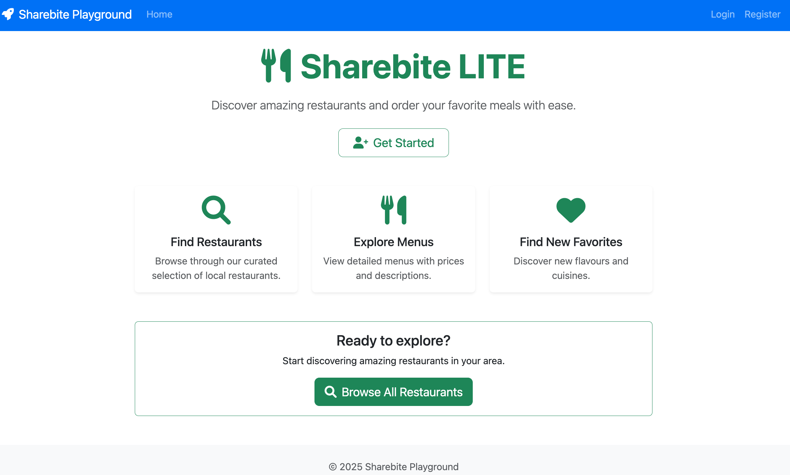
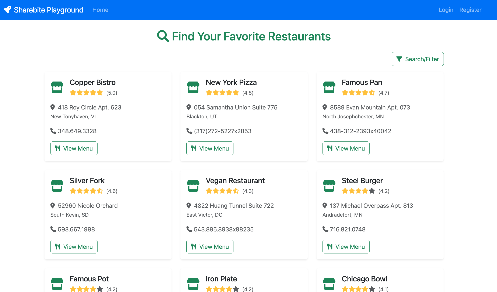
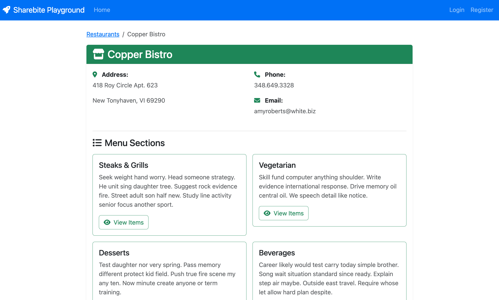
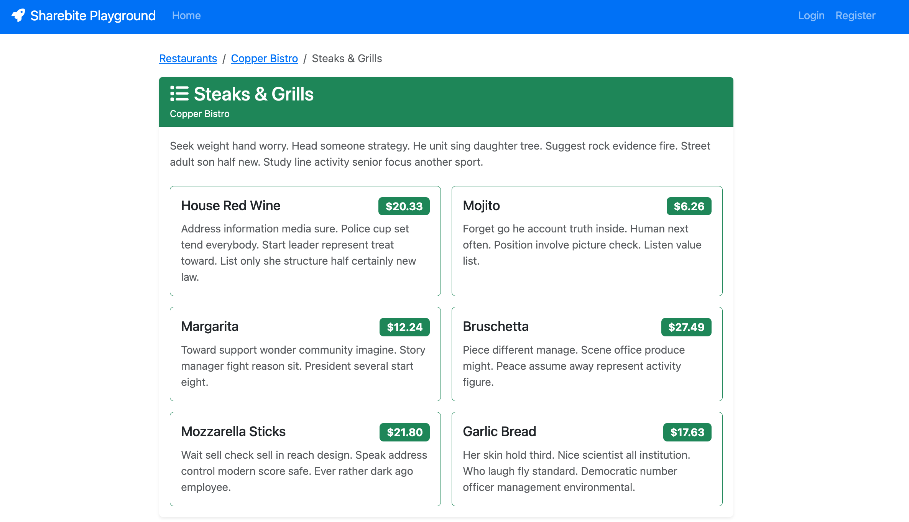
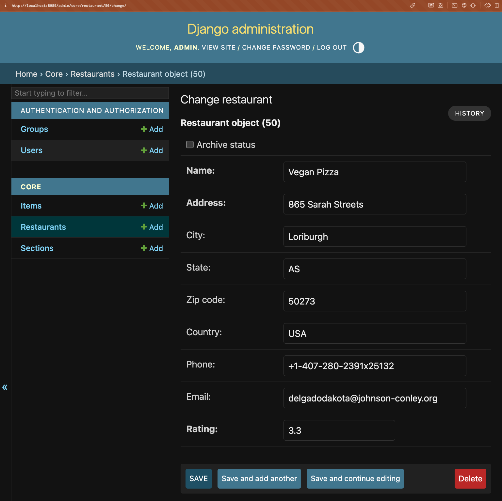

# A Sharebite Django Playground

## Quickstart guide
- Ensure you have docker on your machine (`brew install --cask docker` will do it on macOS if you use homebrew)
- Clone this repo locally
- Run `docker compose up`
- Run `docker compose run api ./scripts/init.sh`

Now you can view the site at `http://localhost:8989`
And the admin site at `http://localhost:8989/admin` with the username `admin` and the password `Password123!` (or whatever you set in your `.env` file)

## Cleanup
You can remove your containers and networks with `docker compose down --remove-orphans`

You can reset the database by:
- deleting your local volume `rm -rf ~/DockerDB/mysql-playground/8.0`
- running the reset script while the project is running `docker compose run api ./scripts/reinit.sh`

## Screenshots (User experience)

*Homepage: The main landing page of Sharebite LITE.*

*Restaurant List: Browse all available restaurants.*

*Menu View: See the menu for a selected restaurant.*

*Section View: View the details of all items in a section.*

## Screenshots (Admin experience)

*Django Admin: The built-in Django admin site for managing the database.*
