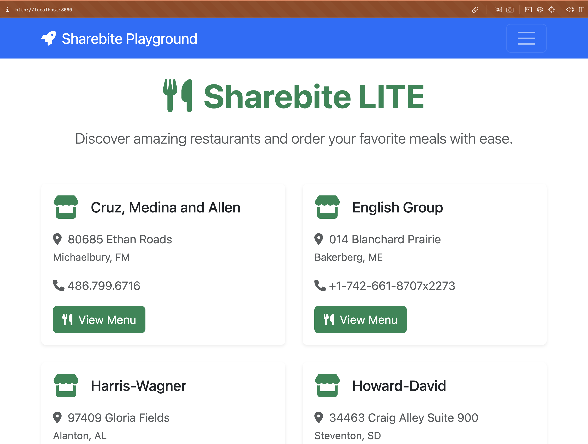

# A Sharebite Django Playground

## Quickstart guide
- Ensure you have docker on your machine (`brew install --cask docker` will do it on macOS if you use homebrew)
- Clone this repo locally
- Run `docker compose up`
- Run `docker compose run api ./scripts/init.sh`

Now you can view the site at `http://localhost:8080`

